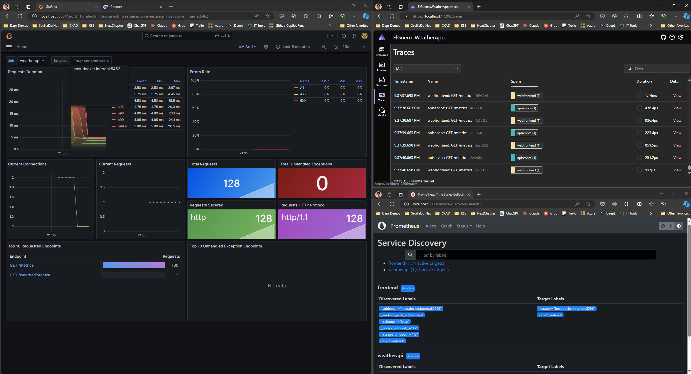

# AspireWeatherApp

## Description

This project is a sample application that demonstrates how to integrate ASPIRE, OpenTelemetry, Prometheus, and Grafana using Visual Studio. It showcases the end-to-end flow of collecting and visualizing application metrics.

## Features

- ASPIRE integration for efficient data processing
- OpenTelemetry for collecting application metrics
- Prometheus for storing and querying metrics data
- Grafana for visualizing metrics in real-time

## Prerequisites

- Visual Studio installed on your machine
- ASPIRE framework installed and configured
- OpenTelemetry .NET SDK installed
- Prometheus server up and running
- Grafana installed and configured

## Installation

1. Clone the repository: `git clone https://github.com/your-username/AspireWeatherApp.git`
2. Open the solution in Visual Studio.
3. Restore NuGet packages.
4. Build the solution.

## Configuration

1. Update the ASPIRE configuration file with your desired settings.
2. Configure OpenTelemetry to send metrics to Prometheus.
3. Configure Prometheus to scrape metrics from your application.

## Usage

1. Start the ASPIRE framework.
2. Start the Prometheus server.
3. Run the AspireWeatherApp project in Visual Studio.
4. Access the application at `http://localhost:5000`.
5. Open Grafana and configure a new dashboard to visualize the metrics.

## Contributing

Contributions are welcome! Please fork the repository and submit a pull request.

## License

This project is licensed under the MIT License. See the [LICENSE](LICENSE) file for more details.
